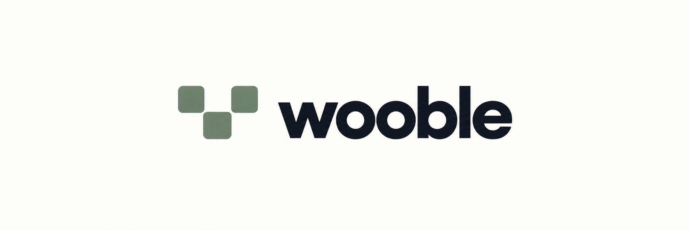

# Wooble Architecture Canvas



Wooble's original code and documentation are dedicated to the public domain. See [licensing details](LICENSING.md).

Wooble gives architecture components stable identities and shows them across multiple canvas views. Anyone designing, explaining, or maintaining a system can start from a system landscape, inspect services and connections, and keep technical context alongside the diagram. Entities (systems, services, databases, and other components) remain separate from their canvas positions, so one model can support multiple views. Read [what Wooble is](docs/product.md) for the product concept.

The app includes a canvas library, a grouped system diagram, selectable protocol connections, a right side inspector, password login, workspace and canvas sharing, an Elysia API running on Bun, and PostgreSQL persistence.

## Roadmap

Wooble's `v0.1.0` public preview is available. The next releases target one usable product outcome every two weeks:

| Release | Initial target | Outcome |
| --- | --- | --- |
| `v0.2.0` | 10 October 2026 | Collaborative documentation with blocks, Markdown import, and live co-editing |
| `v0.3.0` | 24 October 2026 | Usable API and Protobuf contracts on connectors |
| `v0.4.0` | 7 November 2026 | Editable database diagrams from SQL or visual authoring |
| `v0.5.0` | 21 November 2026 | Contextual comments and discussion across architecture details |
| `v0.6.0` | 5 December 2026 | Stability fixes and user experience improvements informed by use |

These are revisable targets for an open-source project, not promised release dates. A version ships when its user journey and [criteria of done](docs/roadmap.md) are met. Follow the [public GitHub Roadmap](https://github.com/users/Dityath/projects/1/views/2) for current dates; contributor-ready tasks are tracked separately in issues.

## Architecture

See the [architecture and tech stack guide](docs/architecture.md) for the current implementation and the [brand guide](docs/brand.md) for visual and voice decisions. [Product direction](docs/product.md) tracks areas that need improvement; [versioning](docs/versioning.md) explains the release path.

This is a Bun workspace managed by Turborepo:

```text
apps/
  web/       React, Vite, TanStack Router/Query, XYFlow, Zustand, Tailwind
  api/       Elysia API and feature routes running on Bun
packages/
  domain/    Shared architecture entity and canvas types
  contracts/ Zod API request/response schemas
  db/        Drizzle schema, migrations, and demo seed
  ui/        Shared UI package boundary
```

Architecture entities live in `entities` and have stable IDs and typed metadata. Their canvas-specific positions and system grouping live in `canvas_nodes`. First class architecture connections live in `connections`, while `canvas_connections` controls which connections appear on a particular canvas. React Flow node data is built from this API model at the frontend boundary; it is not the architecture database model.

## Prerequisites

- Bun 1.3 or later (the web tooling and the API both run on Bun; the API also uses portable Node APIs for the `admin:promote` script)
- Docker with Docker Compose

## Setup

From the repository root:

```sh
bun install
docker compose up -d
bun db:migrate
bun db:seed # optional demo data
bun dev
```

Open [http://localhost:5173](http://localhost:5173). The API is available at [http://localhost:3001](http://localhost:3001), and its health route is `/health`.

The database defaults are suitable for local Docker development. To customize them, copy `.env.example` to `.env` and edit `DATABASE_URL`, `WOOBLE_DB_PORT`, `API_PORT`, `VITE_API_URL`, or `WEB_ORIGIN`. Keep the port in `DATABASE_URL` the same as `WOOBLE_DB_PORT` before starting PostgreSQL. `bun dev` loads `.env` for both apps. Register through the web app to get a new empty **My Workspace** automatically.

## Development commands

For a private self-hosted installation with Docker or Bun, follow [the self-hosting guide](docs/self-hosting.md). The setup above is for local development.

To contribute, follow [CONTRIBUTING.md](CONTRIBUTING.md) and the [issue reporting guide](docs/reporting-issues.md). AI-assisted contributors should read the [AI agent guide](docs/ai-agents.md) and [repository guardrails](AGENTS.md). Pull requests run two sequential GitHub Actions jobs: code quality (lint, formatting, typecheck, build), then web and API tests. Each job publishes a result table in the workflow summary.

| Command | Purpose |
| --- | --- |
| `bun dev` | Run the Vite app and Elysia API through Turborepo |
| `bun run build` | Build all workspace packages and apps |
| `bun typecheck` | Type check every workspace |
| `bun run lint` | Lint JavaScript and TypeScript across the repo with Biome |
| `bun run format` | Format supported source and configuration files with Biome |
| `bun run format:check` | Check formatting without changing files |
| `bun db:migrate` | Apply checked in Drizzle SQL migrations |
| `bun db:seed` | Upsert the fictional example workspace and architecture |
| `bun run --cwd apps/api admin:promote user@example.com` | Promote an already registered account to system admin |
| `bun run --cwd apps/api test` | Run the API integration tests against PostgreSQL |

To run a single app, use `bun run --cwd apps/web dev` or `bun run --cwd apps/api dev`. API and web development servers bind to `0.0.0.0`; Vite proxies `/api` and `/health` to port 3001. The API tests talk to PostgreSQL with `DATABASE_URL` from `.env`, so start the Docker database before running them.

Biome is the repo's linter and formatter. Run `bun run lint`, `bun run format:check`, and `bun run typecheck` before submitting changes. The package-level `lint` scripts remain available for focused checks. CSS formatting is disabled for now to preserve the existing compact stylesheet; Biome still formats JavaScript, TypeScript, and supported configuration files.

If port 3001 is already in use, set `API_PORT=3002` in `.env`; Vite and the API both use that port automatically. If port 5432 is in use, set `WOOBLE_DB_PORT=5433` and use port 5433 in `DATABASE_URL`.

## Accounts and access

Registration creates a personal **My Workspace** with its owner as workspace manager. A manager can create canvases, change workspace members, set canvas viewers and editors, and create one use invitation links. A canvas link takes an unauthenticated recipient through login or registration and then directly to that canvas. A workspace link takes the recipient to the workspace overview, including its empty state. Links expire after 7 days and can be used once.

| Role | Workspace | Canvas |
| --- | --- | --- |
| System admin | Manage every workspace and user role | View, edit, and share every canvas |
| Workspace manager | Manage members and workspace details | Create, edit, share, and delete canvases in that workspace |
| Workspace member | See the workspace | Only canvases explicitly shared with them |
| Canvas editor | Workspace membership is added automatically | View and edit that canvas; cannot manage its access |
| Canvas viewer | Workspace membership is added automatically | View that canvas and open entity details |

A workspace manager can add an existing registered account by email or create an invitation link. The first system admin must be promoted explicitly with the command above; public registration cannot grant admin rights. The app stores scrypt password hashes and hashed, expiring session tokens; session cookies are HttpOnly and SameSite=Lax. Production deployments must use HTTPS with `NODE_ENV=production` and a specific `WEB_ORIGIN` so cookies are Secure and write requests have a trusted origin.

Email ownership is not verified in this local implementation, and there is no email delivery or password recovery flow. Use one use links to grant access when the recipient's account email has not been verified out of band. Add email verification and recovery before exposing public registration on the internet.

## Demo model

The seed creates a separate fictional **Example Engineering** workspace, visible to system admins until they add members. Its **Enterprise Architecture** canvas contains Core Identity and Operations Platform systems, web frontends, API gateways, Go and Rust services, PostgreSQL and SQLite databases, REST and gRPC calls, database connections, and a cross system REST link.

Canvas placement changes are saved through `PUT /api/canvases/:canvasId/placements`. The `GET /api/canvases/:canvasId/graph` response joins the visual placements with shared entities and first class connections. Protocol contracts and database schema details can be edited manually. Automated import and synchronization are future work.

## API routes

- `GET /health`
- `POST /api/auth/register`, `POST /api/auth/login`, `GET /api/auth/me`, `POST /api/auth/logout`
- `PATCH /api/auth/profile`, `PUT /api/auth/password`
- Workspace detail, members, and invitation routes under `/api/workspaces/:workspaceId`
- Canvas access, members, and invitation routes under `/api/canvases/:canvasId`
- `GET /api/invitations/:token`, `POST /api/invitations/:token/accept`
- `GET /api/admin/users`, `PATCH /api/admin/users/:userId`
- `GET /api/workspaces`
- `GET /api/canvases`
- `POST /api/canvases`
- `GET /api/canvases/:canvasId`
- `GET /api/canvases/:canvasId/graph`
- `PUT /api/canvases/:canvasId/placements`
- `GET /api/entities/:entityId`
- `GET /api/connections/:connectionId`

OpenAPI parsing, protobuf, event broker and Harbor/GitHub integrations, schema introspection, and impact analysis are outside this foundation.
